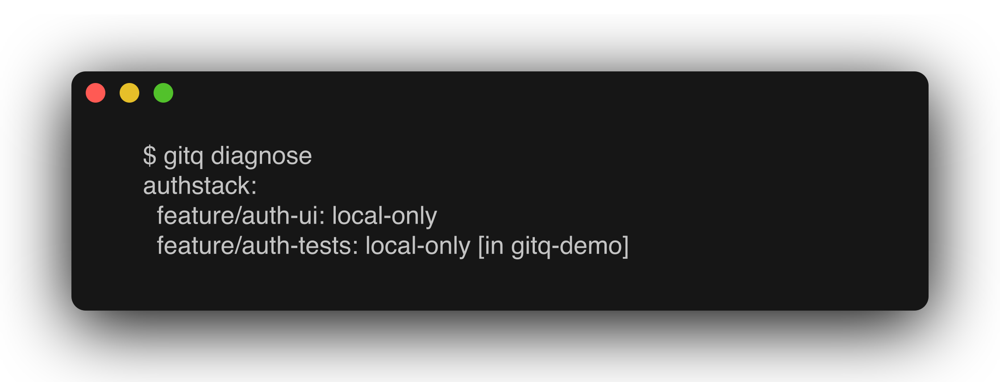

# gitq

gitq turns a chain of dependent git branches into something you can operate on as a unit. Track a stack once, and one command rebases the whole tree onto its new base, distributes uncommitted edits to the branches that own them, or opens and retargets a matching merge/pull request chain on GitLab or GitHub. Every command answers in JSON and exits with a documented code, so agents drive it as comfortably as you do.



## Contents

- [Features](#features)
- [Installation](#installation)
- [Quickstart](#quickstart)
- [Commands](#commands)
- [Conflicts: the pause protocol](#conflicts-the-pause-protocol)
- [Exit codes](#exit-codes)
- [Worktrees and work slots](#worktrees-and-work-slots)
- [Configuration](#configuration)
- [The board](#the-board)
- [Agent skills](#agent-skills)
- [Development](#development)
- [Contributing](#contributing)
- [License](#license)

## Features

- **Stacks, not single branches.** `gitq track` roots a stack, `gitq add` grows it, and `gitq sync` cascades a rebase down the whole tree in one command instead of one `git rebase` per branch.
- **Built for agents.** Every command takes `-C <path>` and `--json`. A rebase conflict during `sync` is a structured pause rather than a failure: git is left mid-rebase, the process exits `2`, and `gitq continue` or `gitq abort` resumes or bails. `gitq preflight` predicts conflicts before you run `sync` at all.
- **`gitq absorb`.** Distributes uncommitted changes to the stack branches that own the lines each edit sits on, with `--preview` to see the attribution before anything is committed.
- **Forge-aware publishing.** `gitq publish` opens or updates an MR/PR chain on GitLab or GitHub, retargeting branches as the stack underneath them changes.
- **Worktree-native.** Cascades run in a leased work worktree with a detached HEAD and move branch refs with compare-and-swap at the end, so your checkout is never switched out from under you.
- **A board and agent skills.** A local web UI shows every tracked stack's branch statuses, MR and pipeline state, and live progress while an agent works a stack from one of the five bundled Claude skills.

gitq is part of the [mattstack](https://github.com/m4ttstack) estate: it talks to GitLab and GitHub through [glance](https://github.com/m4ttstack/glance), can read its settings and grant-gated forge tokens from [rt](https://github.com/m4ttstack/rt), runs as a [deck](https://github.com/m4ttstack/deck) app on the desktop, and launches board actions as agent panes through [herdr](https://github.com/herdrdev/herdr). Only glance ships as a dependency; the CLI works with none of the others installed.

## Installation

```bash
npm install -g @mattstack/gitq
```

That puts a `gitq` binary on your `PATH`. It runs on plain Node 20 or later; you do not need [Bun](https://bun.sh) to use the CLI.

Or run it without installing:

```bash
npx @mattstack/gitq stacks
```

Bun is needed only for the board (`gitq board`), which the node CLI ships without, and for working on gitq itself. See [Development](#development).

## Quickstart

Build a three branch stack in a throwaway repo, move trunk out from under it, and restack all three with one command. gitq compares a stack root against `origin/<root>`, so the demo repo gets a local bare repository standing in for a forge. No network is involved.

```bash
mkdir -p /tmp/gitq-demo && cd /tmp/gitq-demo
git init -b main
echo '# demo' > README.md && git add README.md && git commit -m 'initial commit'
git init --bare -b main /tmp/gitq-demo-origin.git
git remote add origin /tmp/gitq-demo-origin.git
git push -u origin main
```

Tracking is pure bookkeeping. It records which branch roots the stack and touches no git refs:

```bash
gitq track demo --root main
```

Branches are made with plain git; gitq does not create them for you. Make each one, then tell gitq where it sits in the tree:

```bash
git switch -c feat-api main
echo 'export const api = 1;' > api.ts && git add api.ts && git commit -m 'add api module'
gitq add feat-api --parent main

git switch -c feat-handlers feat-api
echo 'export const handlers = 1;' > handlers.ts && git add handlers.ts && git commit -m 'add handlers'
gitq add feat-handlers --parent feat-api

git switch -c feat-docs feat-handlers
echo 'docs' > DOCS.md && git add DOCS.md && git commit -m 'add docs'
gitq add feat-docs --parent feat-handlers
```

Now move trunk, the way a teammate's merge would:

```bash
git switch main
echo 'CHANGELOG' > CHANGELOG.md && git add CHANGELOG.md && git commit -m 'add changelog on main'
git push origin main
```

Ask what that did to the stack:

```console
$ gitq stacks
demo (root main): feat-api -> feat-handlers -> feat-docs

$ gitq diagnose
demo:
  feat-api: behind-parent
  feat-handlers: local-only
  feat-docs: local-only
```

Only `feat-api` reports `behind-parent`, and that is the whole answer: it is the one branch whose parent actually moved. The other two still sit exactly on top of their own parents, and `local-only` means "not published", not "up to date".

Check before you rebase, then restack the whole tree:

```console
$ gitq preflight
demo: dirty=false
  no predicted conflicts

$ gitq sync
completed: feat-api ok, feat-handlers ok, feat-docs ok
```

All three branches were replayed onto the new trunk commit, in order, in a leased work worktree rather than in your checkout.

To clean up, run `gitq untrack demo`, then `rm -rf /tmp/gitq-demo /tmp/gitq-demo-origin.git`. The work worktree the cascade leased sits outside the repo, under `~/.mattstack/gitq/work/<repo hash>/`; delete that one directory too if you plan to recreate the demo at the same path.

## Commands

Every command accepts `-C <path>` (run as if invoked from `<path>`, default cwd) and `--json` (emit machine readable JSON on stdout instead of the human summary). `gitq --help` prints the table, and `gitq <command> --help` prints one command's usage. Commands that operate on more than one tracked stack take `--stack <name>` to disambiguate; it is optional when the repo has exactly one stack.

### Read only

| Command | What it does |
| --- | --- |
| `gitq stacks` | List tracked stacks and each one's branch chain, root to tip. |
| `gitq diagnose` | Per branch situation report for every tracked stack: `behind-parent`, `parent-merged`, `local-remote-diverged`, `local-only`, and so on. |
| `gitq preflight` | Predict rebase conflicts and check for a dirty worktree before you run `sync`. |
| `gitq log` | Show the operation log, which is global across all repos rather than scoped to the current one. |

### Tracking

Which branches gitq knows about. None of these touch git refs.

- `gitq track <stackName> --root <branch>`: start tracking a new stack rooted at `<branch>`.
- `gitq untrack <stackName>`: stop tracking a stack.
- `gitq add <branch> --parent <branch> [--stack <name>]`: add a branch node to a stack under a parent.
- `gitq remove <branch> [--stack <name>]`: remove a leaf branch node from a stack. Refuses if it has children; reparent or remove those first.

### Cascade rebase

- `gitq sync [--no-fetch] [--stack <name>]`: rebase every branch in the stack onto its parent's new head, in order. Exits `2` and leaves git mid-rebase on a conflict. `--no-fetch` restacks onto the local `origin/<trunk>` without touching the network, for parent-child restacks after local commits or when the remote is unreachable.
- `gitq continue`: resume a paused cascade once you have resolved the conflict and staged it. May exit `2` again on the next conflict.
- `gitq abort`: abort the in-progress rebase and clear the pause file.

### Surgery

- `gitq absorb [--at <branch>[:<glob>]]... [--preview] [--stack <name>]`: distribute uncommitted changes to the branches that own the lines each edit sits on, then restack. Attribution blames the changed lines and takes the deepest stack branch owning any of them, falling back to "whose commits touched this file at all" when blame has no answer (a new file, a binary one, lines from outside the stack).
- `gitq split <branch> --at <sha> --name <newBranch> [--stack <name>]`: tail split. Moves everything from `<sha>` onward on `<branch>` into a new child branch.
- `gitq split <branch> --files <glob[,glob...]> --name <newBranch> [--stack <name>]`: split by file. Moves files matching the glob(s) off `<branch>` into a new branch.
- `gitq fold <branch> [--stack <name>]`: fold a branch's commits into its parent, delete it, and reparent its children onto the parent.
- `gitq reparent <branch> --onto <newParent> [--stack <name>]`: move a branch onto a different parent and cascade rebase its descendants.
- `gitq rename <old> <new> [--stack <name>]`: rename a branch, in git and in the stack tree.
- `gitq reset <branch> [--stack <name>]`: reset a local branch to match `origin/<branch>`, for when it diverged because someone force pushed.

`--at` on absorb is repeatable. `--at <branch>:<glob>` claims just the files matching that glob; a bare `--at <branch>` is the catch-all for everything no glob claimed, so there can be only one of those. Because a named target may not hold the version you edited against, each edit is three-way merged onto that branch's copy rather than overwriting the file, and a file that will not merge is left dirty and reported as `unapplied` instead of being committed.

If the restack after absorbing hits a conflict, absorb aborts that rebase (the absorbed commits stay on their branches) and exits `1` telling you to run `gitq sync`, which restacks with full conflict handling.

Reparent has two conflict shapes. If the branch itself cannot be replayed onto the new parent, reparent refuses upfront and exits `1` with nothing moved, and syncing the stack first is the fix. If a conflict shows up in a descendant during the follow-up cascade, it pauses exactly like `sync` does and resolves the same way.

### Forge

The forge is resolved from the git remote's host, so GitLab and GitHub repos work side by side with no per-repo setting. See [Forge tokens](#forge-tokens).

- `gitq publish [--mr-meta <path>] [--stack <name>]`: push and open an MR for every local-only branch in the stack, and update the MRs of branches that already have one.
- `gitq push [--preview] [--stack <name>]`: force-with-lease push every published, unmerged branch whose remote is behind its local head, which is the state a restack leaves every MR in. It needs no forge token and makes no API call: it reads which branches are published from the local store and moves refs.
- `gitq import [--replace]`: pull stacks for the current repo's remote back from the forge into local tracking. Meant for recovery, not routine use.

On an update, `gitq publish` retargets an MR whose target no longer matches the branch's nearest live ancestor, walking up past any branch already merged so a child is never pointed back at a branch the forge deleted on merge. Title and description are rewritten only when `--mr-meta` names that branch. A published branch whose MR is closed, unreadable, or opened from some other branch is reported as skipped rather than written to, so an empty result really does mean nothing needed doing. Already published branches are not pushed; that is `gitq push`'s job.

`--mr-meta` points at a JSON file of `{"<branch>": {"title": "...", "description": "..."}}`. Branches not listed get defaults on a new MR and keep what they have on an existing one, and an empty string reads as "not provided" rather than as a value to write.

`gitq push` never fetches, on purpose. `--force-with-lease` compares against the remote-tracking ref, and refreshing that first would bless someone else's push and then overwrite it. A remote that moved is reported as `REJECTED` with the fix rather than forced, and one rejection fails that branch only while the walk continues.

`gitq import` rebuilds the whole local store and re-mints stack ids, so it refuses when the repo already has tracked stacks unless you pass `--replace`. The store check runs before the token check, so the refusal works offline.

### Other

- `gitq undo`: undo the last reversible operation from the operation log, restoring the branches it touched to their pre-operation state.
- `gitq board`: serve the web board (needs Bun). See [The board](#the-board).
- `gitq job-status <statePath> <status> [detail]`: write a board job-state file by absolute path. Used by the bundled skills.

## Conflicts: the pause protocol

`gitq sync`, and `gitq reparent` when its cascade hits a conflict, rebases branches one at a time. When a rebase step conflicts, gitq leaves git in a normal mid-rebase state, the same as running `git rebase` by hand would, in the leased work worktree rather than your checkout, and writes `<gitdir>/gitq-pause.json` recording which branch and commit it stopped on. The command exits `2` rather than `1`, so a caller can tell a deliberate pause apart from a real failure.

To get unstuck, resolve the conflict with raw git (edit files, `git add`), then run `gitq continue`. It picks the rebase up from where it paused and keeps walking the rest of the stack, and it can exit `2` again immediately if the next branch also conflicts, under the same protocol. To bail out instead, `gitq abort` aborts the rebase in progress and clears the pause file.

Under `--json`, `pauseInfo.conflictFiles` is always present as the list of conflicted file paths. `pauseInfo.conflictTypes` is added when git can classify them, pairing each file with its two-letter porcelain status code (`UU` both modified, `AA` both added, `UD` modified/deleted). Read `conflictFiles` for the plain list and `conflictTypes` when you want the codes.

Every state-mutating command (`add`, `remove`, `untrack`, the surgery commands, `publish`, `import`, `undo`, and starting a fresh `sync`) refuses while a pause file is present for the repo. Finish or abort the paused cascade first. The read-only commands and `continue`/`abort` are exempt.

## Exit codes

| Code | Meaning |
| --- | --- |
| `0` | Success. |
| `1` | A hard failure, or a run that completed with a failed per-branch result. |
| `2` | A cascade paused on a conflict. Resolve and run `gitq continue`, or `gitq abort`. |

Hard failures (bad usage, unknown command, no such stack, a missing token for the repo's forge, refusing to run while a cascade is paused, refusing to overwrite a non-empty store on `import` without `--replace`) go to stderr as plain text prefixed `gitq:`, with exit code `1`, whether or not you passed `--json`. Nothing is written to stdout for these, so do not try to parse stderr as JSON.

A command can also exit `1` after emitting its normal stdout JSON. `sync`, `continue`, `absorb`, and `publish` report structured per branch (or per MR) results, and the process exits `1` if any individual result failed even though the command itself ran to completion. Check the JSON's per item `success` fields for that case, not just the exit code.

`undo` does not fit that pattern: it reports one top-level `success` for the whole restore rather than a result per branch. Branches git no longer has, deleted externally after the operation being undone, are skipped rather than failing the restore and are dropped from the restored stack. `undo` still exits `0` on a partial restore, even one where every snapshotted branch ended up skipped, so read the JSON's `skippedBranches` array (informational, not pass/fail) to see what was left out. It exits `1` only when the log entry had no branch snapshots to restore in the first place, or on a hard failure as above.

## Worktrees and work slots

gitq is worktree-native. The stack store is keyed by the repo's git common dir, so every worktree of a repo sees the same stacks and any `gitq` command works from any of them.

Cascades (`sync`, `continue`, `reparent`'s restack, `absorb`'s restack) never run in your checkout. gitq leases a dedicated work worktree named `gitq-1`, `gitq-2`, and so on, rebases there with a detached HEAD, and moves branch refs with compare-and-swap at the end. Slots land as siblings of the primary worktree when the repo already sits in a pool of worktrees, and under `~/.mattstack/gitq/work/<repo hash>/` otherwise; setting `workSlotLocation: "root"` keeps them out of the pool always. Up to `maxWorkSlots` (default 3) cascades can run per repo at once, one stack each, and a stack with a running or parked cascade refuses other mutations until it finishes.

A branch checked out in one of your own worktrees is handled by policy. If that worktree is clean and sitting exactly on the branch's old head, gitq moves the ref and resets the worktree to the new head, losing nothing. If it is dirty, mid-rebase, or drifted, that branch fails with a message naming the worktree and nothing is touched.

Conflict pauses live in the work slot. The paused JSON's `pauseInfo.worktreePath` says where to resolve, and `gitq continue` and `gitq abort` find the parked cascade from anywhere; pass `--stack` when more than one is parked. `gitq stacks` and `gitq diagnose` report the worktree map (`worktrees`, and per-branch `checkedOutIn`), and `gitq preflight` predicts slot conflicts (`slotConflicts`) before you sync.

Surgery is pooled too. Reparent, fold, and file splits do their rebasing detached inside a leased work slot, tail splits are pure ref surgery, and absorb restacks through the slot after committing in the worktree you ran it from.

## Configuration

### Where state lives

gitq keeps almost nothing in your repository.

| Location | What it holds |
| --- | --- |
| `~/.mattstack/gitq/` | The app root: stack stores (one JSON file per repo under `stacks/`, keyed by a hash of the repo path), `settings.json`, the global `operation-log.json`, the work slots gitq creates under `work/`, and the board's `config.json` and `state/jobs/`. |
| `<commonDir>/gitq/leases.json` | Per-repo work-slot lease registry: which stack holds which work slot. |
| `<gitdir>/gitq-pause.json` | Present only while a cascade is paused on a conflict. Keyed off the git dir rather than the worktree root, so it is worktree safe. During a cascade this lives in the work slot's git dir, not your checkout's. |

`GITQ_APP_ROOT` moves the whole root. `GITQ_CONFIG_DIR` moves just the CLI's subset and wins over it, which makes it a one-line way to point an experimental run at a throwaway store. The board's own files do not follow `GITQ_CONFIG_DIR`: a throwaway stack store should not also repoint the board.

Stores created by older gitq versions, keyed by a single worktree's path, migrate automatically the first time you run gitq from that worktree. If you used gitq before it moved to the app root, the first run copies `~/.config/gitq` in (work slots used to live in `~/.cache/gitq/work`), leaves the original in place for you to delete, and never merges into a root that already holds files. Slots already leased under the old root keep working untouched.

### Forge tokens

`gitq publish` and `gitq import` need a token, and which one follows from your git remote's host. A `gitlab.com` remote wants `GITLAB_TOKEN` in the environment; a `github.com` remote wants `GITHUB_TOKEN`. Everything else in gitq works with no credentials at all.

Neither token is ever read from a plaintext file. When the environment variable is unset, gitq asks the rt daemon for a grant-gated token (`secrets:forge-token`), which requires the repo to be tracked with rt (`rt daemon track <repo> live branches`) and refuses otherwise, naming the reason.

Self-hosted GitLab and GitHub Enterprise work too, but a hostname does not say which forge it runs, so they need an entry in `gitq.forges`:

```json
{ "forges": { "gitlab.example.com": { "provider": "gitlab" } } }
```

An entry may also carry `baseUrl` (defaults to `https://<host>`, and is required when the key is an ssh alias rather than a real domain) and `tokenEnv`, naming the environment variable holding that instance's own token.

### Settings

gitq reads three settings from the [rt](https://github.com/m4ttstack/rt) settings store when it is available, each falling back to a local file when the store does not own the key yet.

| Key | Scope | Shape | File fallback |
| --- | --- | --- | --- |
| `gitq.workSlots` | machine | `{ maxWorkSlots?, workSlotLocation? }` | `~/.mattstack/gitq/settings.json` |
| `gitq.forges` | user | host-keyed map, naming `tokenEnv` variables only, never a live token | `~/.mattstack/gitq/settings.json` |
| `gitq.board` | machine | `{ repos, port, herdrWorkspace }` | `<app root>/config.json` |

Set one with the rt CLI:

```bash
rt settings set gitq.workSlots '{"maxWorkSlots":4}' --scope machine
```

`rt settings set <key> <json-value> --scope user|team|machine` **replaces the whole value stored at that key and scope**. It is not a merge, so a value with more than one field needs every field you want to keep in the JSON you send, not just the one you are changing. Check what is there first with `rt settings explain gitq.workSlots`.

Precedence differs by key. `gitq.forges` and `gitq.board` are wholesale, meaning an owning store value replaces the file's entirely. `gitq.workSlots` is per field: `maxWorkSlots` and `workSlotLocation` each fall back to the file independently when the store does not have that particular field. Either way, until a key (or, for `workSlots`, a field) is imported into the store, its file remains the only place to edit it. The transition is opt-in, not a flag day.

## The board

A local web board showing every configured repo's stacks: per branch status badges from `gitq diagnose`'s engine plus a "conflict predicted" hint from preflight, MR and pipeline state per repo when that repo's forge token is available, live job chips while an agent pane works, and an activity feed from the operation log. It also shows each branch's checkout slot with dirty ones highlighted, the work slots' lease state, and lets absorb source from any dirty worktree.

Right-clicking a stack offers four actions. Each one spawns a herdr tab running `claude` with the matching `gitq:*` skill, so the badge updates live while the agent works. Relaunching a live action refocuses its tab instead of double-spawning.

```bash
mkdir -p ~/.mattstack/gitq
cp config.example.json ~/.mattstack/gitq/config.json   # edit: repos to show, port (default 11008), herdrWorkspace
bun run serve                                          # http://localhost:11008
```

`$PORT` wins over the configured port, so a launcher can pin it independently. Config changes need a restart, and so do client changes, since the client bundle is built in memory at startup. `style.css` edits are live.

Endpoints are `/` (the board), `/data.json` (snapshot; `?fresh=1` forces a refetch), `POST /action` with `{ repoPath, stack, action }`, and `/healthz`. The action route only answers requests whose Host is local (`localhost`, `127.0.0.1`, `*.localhost`), so through a tunnel the board is read only and the client hides the action menu items.

Repo data is cached in memory for 60 seconds with stale-while-revalidate. Job state files under `<app root>/state/jobs/` are read fresh on every request and pruned once terminal and older than 24 hours. MR enrichment needs the same token as `publish`, resolved per repo from that repo's own remote host, so a board showing a GitLab repo alongside a GitHub one enriches each from its own credential; a repo whose token is missing still renders from the store's last known MR fields.

`bun run build:binary` compiles a standalone `dist/gitq` carrying its own client bundle, so `gitq board` serves the page on a machine with no checkout on it. See [docs/releasing.md](docs/releasing.md).

## Agent skills

`skills/` holds five [Claude](https://claude.com/claude-code) skills that drive this CLI from an agent pane. Install them as symlinks into `~/.claude/skills`:

```bash
bun run scripts/install-skills.ts
```

Four are one per board action:

- `gitq:sync`: cascade rebase with judgment-based conflict resolution.
- `gitq:publish`: push and MR chain, with a human gate before anything leaves the machine.
- `gitq:absorb`: distribute uncommitted changes, preview first.
- `gitq:restructure`: split, fold, reparent, and rename surgery from a plain language instruction, gated on a plan.

The fifth, `gitq:track`, is how a stack gets onto the board in the first place. Point it at a repo and it works out whether the branches are a new stack, a hand-built chain to adopt, or an already-published MR chain, then tracks them accordingly.

The four board skills take `<repoPath> <stackName>` positionals plus optional `--state <path>` and `--status-bin <path>` flags. The board injects those two so the pane can emit lifecycle status (`starting`, `working`, `conflict`, `done`, `error`) to a JSON state file under `<app root>/state/jobs/`. Invoked by hand without them, the skills skip status writes and just talk to you. `--status-bin` is the gitq executable itself, called as `<status-bin> job-status <statePath> <status> [detail]`. `gitq:track` has no board action behind it, so it takes only an optional `[repoPath]` and never writes status.

## Development

```bash
git clone https://github.com/m4ttstack/gitq.git
cd gitq
bun install
bun run build
bun link
```

`bun link` puts this checkout's `gitq` on your `PATH` through the package's `bin` entry, `bin/gitq.mjs`, which loads the built bundle at `dist/gitq.js`. That is why `bun run build` comes first, and why it has to run again after a source change.

To skip the build loop while developing, run the TypeScript sources straight from the checkout instead:

```bash
bun bin/gitq stacks
```

- [docs/testing.md](docs/testing.md): running the unit and integration suites, and the two tests that write to a real forge.
- [docs/releasing.md](docs/releasing.md): cutting a version and the release artifact contract.

The full documentation site (getting started, concepts, guides, and a reference page per command) is Docusaurus source under [`website/`](website/). Run it locally with `cd website && bun run start`.

## Contributing

Issues and pull requests are welcome at [github.com/m4ttstack/gitq](https://github.com/m4ttstack/gitq).

Before opening a PR, run `bun run check-types` and `bun run test`. A new CLI command also needs a reference page under `website/docs/reference/<category>/<command>.mdx`; `tests/docs-coverage.test.ts` fails the suite when a command has no page, or when a page has no command.

## License

MIT. See [LICENSE](LICENSE).
