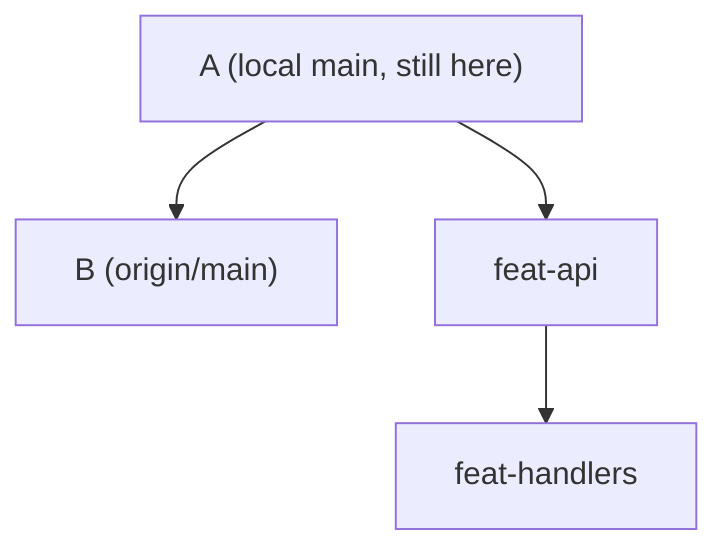
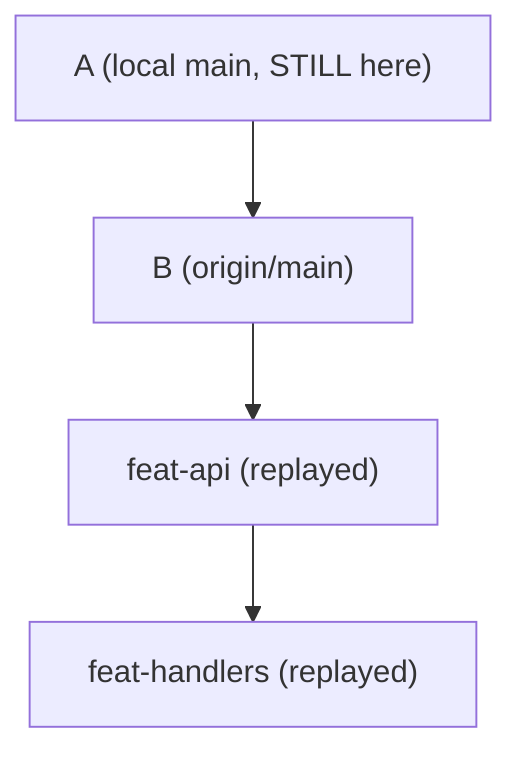

# The cascade

A cascade is gitq rebasing a whole tree of branches in one pass, parents before children, each branch onto its parent's new head. `gitq sync` is the cascade you will run most, and it is what this page mostly describes. Of the surgery commands, only `reparent` runs this same cascade: after its own move succeeds, it cascades the moved branch's descendants through it. `fold` and `split --files` never cascade descendants at all, and `absorb` restacks its descendants through a separate loop with its own, much simpler, conflict behavior. [The other cascades](#the-other-cascades) below says exactly what each command does.

## The one thing to know first

:::danger `sync` never touches your local trunk

`gitq sync` does not move, fetch into, fast-forward, or otherwise modify the local root branch. Not once, not ever.

What it moves is **the branches whose parent is the stack root**: those rebase onto `origin/<root>`, the remote-tracking ref, directly. Your local `main` can sit ten commits behind forever and the stack will still be correctly rebased on top of the real trunk.

:::

This is the single most misreadable thing about gitq, and it is deliberate: it means a cascade cannot fight with `main` being checked out in another worktree, and it means the stack's base is whatever the remote actually says, not whatever your last `git pull` left behind.

The knock-on effects are worth spelling out:

- `gitq sync` runs `git fetch origin` first, every time, before anything else. If the fetch fails, sync throws and exits `1` with `gitq: Failed to fetch from remote: ...`. **A repo with no `origin` remote cannot sync.**
- If `origin/<root>` does not resolve after that fetch (the remote has no such branch), sync returns an empty result: it prints `completed:` with nothing after it and exits `0`, having done nothing at all. There is no warning. If a sync looks suspiciously fast and its output is bare, check that `origin/<root>` exists.
- After a sync, your local trunk is still stale. Pull it whenever you like; it changes nothing about the stack.

## The walk

```
gitq sync
  ├─ git fetch origin                      throws on failure
  ├─ resolve origin/<root>                 unresolvable: return, exit 0
  ├─ topological sort, parents before children
  └─ for each node:
        skip if unmanaged
        work out the old base (where this branch's own commits start)
        record this branch's head BEFORE anything rewrites it
        reconcile first if the parent was merged
        skip the rebase if the branch is already merged
        replay onto the target, detached, in a work slot
        move the branch ref with a compare and swap
```

The order comes from a breadth-first walk down from the root, so a parent is always finished before any of its children is attempted. The target for each branch is its nearest live ancestor: the parent branch's freshly rewritten head, or `origin/<root>` if that ancestor is the stack root.

A branch that is already sitting exactly on its parent's head is skipped and produces no output line. Only the branches sync actually attempted appear in the `completed: ...` summary.

## Before and after

A stack cut from trunk at commit `A`, with trunk since moved to `B`:



After `gitq sync`:



Every commit above `B` is a new commit with a new hash. Local `main` did not move, and did not need to.

## Why a rebased parent does not duplicate itself into its children

Before gitq rewrites any branch, it records that branch's current head. When it reaches a child, it uses the parent's **old** head, the one it just recorded, to work out where the child's own commits begin: the fork point is the merge base of the child against the parent as it was, not as it now is.

That is the difference between replaying two commits and replaying nine.

If gitq instead asked "where do these two branches diverge?" against the parent's *new* head, git would answer with the original base commit, because the rewritten parent shares no commits with the child any more. The child's replay range would then include the parent's pre-rebase commits as well as its own. Usually those extra commits drop out silently, because git recognises them by patch id as already applied. But if you resolved a conflict while rebasing the parent, the parent's commits no longer match by patch id, and every one of them comes back as a conflict on the child. The stale-head bookkeeping is what stops that.

It survives a pause, too. The recorded heads are written into the pause file, so `gitq continue` resumes with the same fork points the original run computed rather than re-deriving them from rewritten history.

## When the parent was merged

A branch whose parent has been merged (usually squash-merged, so the parent's commits exist upstream under a different hash) cannot simply rebase onto its parent: the parent is gone as a base. gitq handles it in two steps.

**Step one, reconcile.** The child's own commits are replayed onto the merged parent's final state, its tombstone. The tombstone is the merged parent's branch tip if git still has it, falling back to the node's stored `lastKnownHead`. This is not ceremony: it is how the child picks up whatever the parent gained during review after the child branched off it. The fork point comes from the reflog first (`git merge-base --fork-point`), then the node's stored `forkPoint`, then a plain merge base. If none of the three can be resolved, gitq skips reconciliation and lets the main rebase land the child on the target anyway.

**Step two, cascade.** The reconciled commits are then replayed onto the real target, which is the nearest ancestor that is not itself merged, walking up the tree, and `origin/<root>` if that walk reaches the root.

Two special cases sit alongside this:

- **The merged branch itself is skipped, and its ref is not moved.** It reports `ok` and stays exactly where it is, because that ref *is* the tombstone its children are measured against. Moving it to trunk would destroy the only record of where their work began. A merged branch keeps its old head until you `gitq remove` it.
- **A fully redundant branch is fast-forwarded, not rebased.** Before rebasing, gitq compares the branch's commits against the target by patch id (`git cherry`). If every one of them is already present upstream, there is nothing to replay: the branch ref is moved straight to the target and the branch reports `ok`. This is the normal ending for a branch whose entire content went in with its parent's squash merge.

`gitq preflight --json` warns about the branches that will need reconciling, as `stacks[].report.driftWarnings`, one entry per branch. The plain-text output does not print it: today it only shows dirty state, predicted conflicts, and slot conflicts. Ask for `--json` if reconciling is what you are checking for. See [Reading the tree](/getting-started/reading-the-tree).

## Where the rebase actually happens

Not in your checkout. gitq leases a work slot, a dedicated `gitq-N` worktree, checks out the branch's old head there **detached**, and runs `git rebase --onto <target> <oldBase>` in that worktree. Your branch ref does not move while any of this is happening.

Only when the replay succeeds does gitq move the ref, and it moves it with a compare and swap: `git update-ref refs/heads/<branch> <newHead> <oldHead>`. If the branch is no longer where it was when the cascade started, the swap fails and the branch reports failed instead of quietly clobbering whatever moved it.

Consequences:

- A cascade that dies halfway, crashes, or is killed leaves your working tree untouched, but what happens to the abandoned slot depends on how far it got. A slot left detached and clean, before any rebase started, is picked back up and reused the next time a cascade needs one. A slot left **mid-rebase** is excluded from that reuse instead: both the free-slot lookup and slot provisioning skip a worktree with a rebase in progress. gitq just creates another slot rather than touching it, and the abandoned mid-rebase state stays on disk in the old one. This is the usual reason the slot count creeps toward `maxWorkSlots`: not several cascades running at once, but one dead one nobody cleaned up. See [Work slots and leases](/concepts/work-slots).
- If the branch being moved is checked out in one of your own worktrees, a policy applies: clean and sitting exactly on the old head, and gitq moves the ref and resets that worktree for you; dirty, mid-rebase, or drifted, and the branch fails with a message naming the worktree.
- The first failure stops the walk. Branches after it are left alone.

[Work slots and leases](/concepts/work-slots) covers the slots, the lease, and the checked-out branch policy in full.

## When a step conflicts

It pauses. It does not fail, and it does not roll back the branches it already finished.

gitq leaves a normal mid-rebase state in the work slot, writes a pause file recording which branch, which commit, which files, and what remains, parks the lease so the stack refuses other mutations, and exits `2`. Exit `2` means "stopped on purpose"; exit `1` means something actually failed.

You resolve it with plain git in the worktree the pause names, `git add` the result, and run `gitq continue`, which picks the rebase back up and keeps walking the rest of the tree. It can pause again immediately if the next branch also conflicts. `gitq abort` aborts the in-progress rebase instead.

[The pause protocol](/concepts/pause-protocol) is the full contract; [Resolve a conflict](/guides/resolve-a-conflict) is the walkthrough.

## What a cascade does not do

- **It does not push.** After a sync, every rebased branch has diverged from its published counterpart and needs a force push. The JSON output's `rebasedBranches` lists exactly which ones. See [Publish to GitLab](/guides/publish-to-gitlab).
- **It does not restructure.** The tree comes out of a sync with the same shape it went in with. Changing the shape is [surgery](/reference/surgery/reparent).
- **It does not skip branches for you.** Every node is attempted unless it is marked `unmanaged`, in which case it is visible in the tree and permanently skipped by the cascade.
- **It does not touch the local root branch.** Yes, this is the third time. See above.

## The other cascades

`gitq sync` fetches and rebases the entire stack onto the remote trunk. Of the surgery commands, only `reparent` runs this same cascade. Once the moved branch's own rebase onto its new parent has succeeded, `reparent` cascades that branch's descendants onto its new head: narrower scope, no fetch, but the same pause protocol, the same work slot, the same compare and swap, the same output shape. It can pause at exit `2`, exactly like `sync`.

**`fold` and `split --files` do not cascade.** `fold` re-parents the folded branch's children in the stack tree only; it never rebases them. In the common case that is fine, because the parent lands exactly where the folded branch's old head was and the children are already sitting on it, but if the parent had moved ahead, the children are simply left behind their new parent until you `sync`. `split --files` never touches the descendants of the branch it splits at all.

**`absorb` does restack descendants, but through a separate loop, not this cascade.** It amends the tip commit of every branch it attributes a file to, then replays each affected descendant onto its amended parent. That loop has **no pause protocol**: if a replay conflicts, absorb aborts the in-progress rebase outright and exits `1`, telling you to run `gitq sync` instead. `gitq continue` has nothing to resume there, since absorb never parks a lease; running it gets you `nothing to continue (no parked cascade)`.

**Even `reparent`'s own move can refuse instead of pausing.** If the branch's own rebase onto its new parent conflicts, before any descendant is touched, `reparent` refuses the whole operation ("nothing was moved") and exits `1` rather than leaving a pause behind. Only the descendant cascade, once that first move has already succeeded, can pause at exit `2`.

## Next

- [Work slots and leases](/concepts/work-slots): where the rebase runs and what stops two cascades colliding.
- [The pause protocol](/concepts/pause-protocol): exit `2`, the pause file, and the resolve loop.
- [`gitq sync`](/reference/cascade/sync): the command reference, flag by flag.
