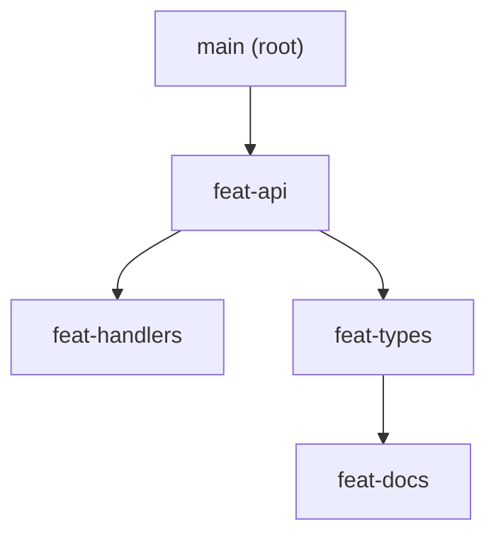

# The stack tree

A stack is a tree of branches with exactly one root, recorded in gitq's store. gitq keeps the tree; git keeps the commits. Everything else on this site is either a question about that tree, an edit to that tree, or a rewrite of the commits the tree points at.

## One root, many nodes

A stack has a name, a root branch, and a flat list of nodes. Each node is one branch plus the name of its parent. That parent link is the whole structure: the tree is reconstructed by following `parent` names, not by storing children.

That is a legal stack. `feat-api` has two children, and the branches below each of them are independent chains. Nothing in the model says a stack is a straight line; `gitq stacks` prints the branches on one line in the order they are stored, joined with `->`, which reads like a chain, but the shape is a tree. That stored order is not kept topologically sorted, either: a `reparent` moves a node without reordering the list, so after enough surgery the printed order can put a branch before its own parent. Use `gitq diagnose --json` when you need the real edges.

## The root is the target, not a node

The root branch is stored on the stack, and it is deliberately not one of the nodes. It is the branch the stack grows from and the branch the bottom of the stack rebases onto, typically `main`.

Two consequences follow from that, and both surprise people:

- gitq never manages the root. It does not rebase it, reset it, push it, or diagnose it as a branch. It only reads it.
- When it matters, the root is read as `origin/<root>`, not as your local branch. `gitq diagnose` compares against the remote trunk, and `gitq sync` rebases root-parented branches onto `origin/<root>` while leaving your local trunk exactly where it is. See [The cascade](/concepts/cascade), which is where this bites.

## What a node stores

A node is metadata about a branch, never a copy of it. The fields worth knowing:

| Field | What it is |
| --- | --- |
| `branch` | The git branch name. Unique within the stack, and the key for everything else. |
| `parent` | The branch this one sits on. Either another node's `branch`, or the stack's `root`. |
| `status` | `local-only`, `synced`, `drift`, or `merged`. How the branch relates to its merge request, not to git. |
| `mrIid`, `mrUrl`, `mrTitle` | The merge request, once `gitq publish` or `gitq import` has filled them in. Null before that. |
| `pipelineStatus`, `unresolvedThreads`, `diffStats` | Forge data, refreshed when gitq talks to the forge. What the board and `diagnose` render badges from. `unresolvedThreads` is `null` when the forge would not report a count, which is not zero. |
| `lastKnownHead` | A SHA: this branch's head at a known good point. When the branch is later marked `merged`, this is the tombstone that its children are replayed off. |
| `forkPoint` | A SHA: the parent's head when this branch was created. A fallback fork point when the reflog can no longer supply one. |
| `unmanaged` | Optional. When true, the node shows up in the tree but the cascade skips it entirely. |

The stack itself carries an `id` (a UUID, never shown to you), the `stackName` you passed to `gitq track`, the `root`, and the nodes. Commands take `--stack <stackName>`, and the flag is optional in a repo with exactly one tracked stack.

`lastKnownHead` and `forkPoint` are the only two fields that ever point at a commit, and both exist for one purpose: to remember where a branch's own work begins after the history under it has been rewritten. The [cascade](/concepts/cascade) page covers what they are used for. See [JSON output](/reference/json-output) for the full serialized shape.

## Tracking is bookkeeping

`gitq track`, `gitq untrack`, `gitq add`, and `gitq remove` edit the store and nothing else. They do not create branches, delete branches, move refs, or touch your working tree. `gitq track` on a stack whose branches do not exist yet is fine. `gitq untrack` on a stack you are mid way through is fine too; the branches survive, gitq just forgets the shape.

The one exception is `gitq rename`, which really does rename the git branch (`git branch -m`) and then updates the node and every child's `parent` reference to match. The git rename runs first, so a name that is already taken in git fails before the tree is touched.

Everything else that rewrites commits is on the [surgery](/reference/surgery/absorb) and [cascade](/reference/cascade/sync) pages, and every one of those commands is explicit about it.

## What the tree refuses

The tree operations validate before they return, so an illegal shape never reaches the store:

- `add` refuses a branch already in the stack, and refuses a parent that is neither the root nor an existing node.
- `remove` refuses a branch that still has children. Re-parent or remove them first. ([`reparent`](/reference/surgery/reparent) is the tool for that.)
- `reparent` refuses a move that would put a branch under its own descendant, because that is a cycle.
- `rename` refuses a new name that already exists in the stack.

These are checks on the tree, not on git. A branch that git deleted out from under you stays in the tree until you remove it, and `gitq diagnose` reports it as `branch-deleted-remote` or leaves it failing against git. See [Reading the tree](/getting-started/reading-the-tree) for how each situation is reported, and [Recover](/guides/recover) for cleaning up after git and the store disagree.

## Where the tree lives

One JSON file per repo under `~/.mattstack/gitq/stacks/`, keyed by the repo's git common dir so every worktree of the repo sees the same stacks. Deleting it loses the tree and nothing else. [Where state lives](/concepts/state) has the details.

## Next

- [The cascade](/concepts/cascade): what `gitq sync` does to this tree's branches.
- [Track](/reference/tracking/track) and [add](/reference/tracking/add): the command level reference for building a tree.
