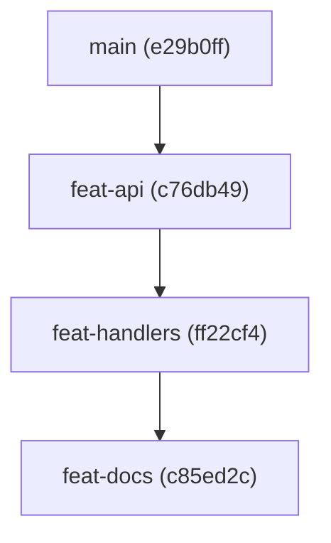
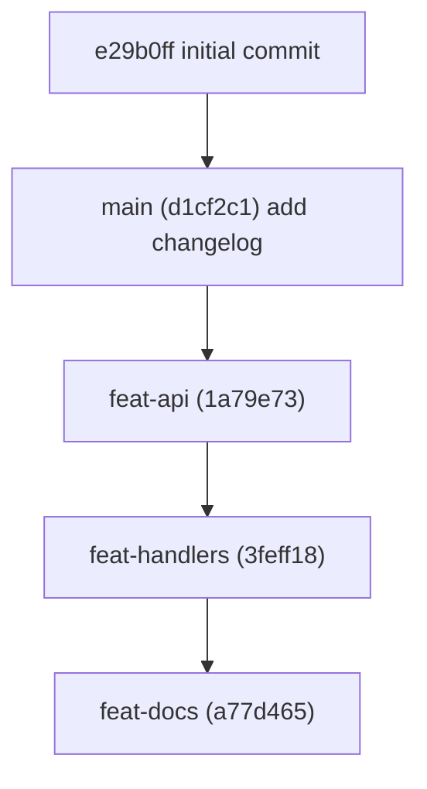

# Your first stack

By the end of this page you will have a three branch stack in a throwaway repo, you will have moved trunk out from under it, and you will have restacked all three branches onto the new trunk with one command. Nothing here touches a repo you care about.

Every command and every output block below came from a real run. Only the commit hashes will differ when you do it.

:::note gitq measures a stack against `origin/<root>`

gitq compares the stack root against `origin/<root>`, not your local branch, and branches whose parent is the root rebase directly onto `origin/<root>` when you sync. Your local trunk branch is never rewritten. In a repo with no `origin` remote, `gitq diagnose` cannot see that trunk moved and `gitq sync` fails outright at the fetch. So this tutorial gives the scratch repo a remote: a local bare repository standing in for GitLab. No network involved.

:::

## 1. A repo with a trunk

```bash
mkdir -p /tmp/gitq-demo && cd /tmp/gitq-demo
git init -b main
git config user.email you@example.com
git config user.name "you"
echo '# demo' > README.md
git add README.md
git commit -m 'initial commit'
```

```
[main (root-commit) e29b0ff] initial commit
 1 file changed, 1 insertion(+)
 create mode 100644 README.md
```

Now the stand-in remote, and push trunk to it:

```bash
git init --bare -b main /tmp/gitq-demo-origin.git
git remote add origin /tmp/gitq-demo-origin.git
git push -u origin main
```

```
To /tmp/gitq-demo-origin.git
 * [new branch]      main -> main
branch 'main' set up to track 'origin/main'.
```

## 2. Track a stack

Tracking is pure bookkeeping. It creates a stack in gitq's store and records which branch is its root. No git refs are touched.

```bash
gitq track demo --root main
```

```
tracked demo (root main)
```

## 3. Three branches, three commits

Branches are made with plain git. gitq does not create them for you.

```bash
git switch -c feat-api main
echo 'export const api = 1;' > api.ts
git add api.ts && git commit -m 'add api module'
```

```
Switched to a new branch 'feat-api'
[feat-api c76db49] add api module
 1 file changed, 1 insertion(+)
 create mode 100644 api.ts
```

Then tell gitq where the branch sits in the tree:

```bash
gitq add feat-api --parent main --stack demo
```

```
added feat-api under main
```

Repeat, each branch cut from the one before it:

```bash
git switch -c feat-handlers feat-api
echo 'export const handlers = 1;' > handlers.ts
git add handlers.ts && git commit -m 'add handlers'
gitq add feat-handlers --parent feat-api --stack demo
```

```
added feat-handlers under feat-api
```

```bash
git switch -c feat-docs feat-handlers
echo 'docs' > DOCS.md
git add DOCS.md && git commit -m 'add docs'
gitq add feat-docs --parent feat-handlers --stack demo
```

```
added feat-docs under feat-handlers
```

`--stack demo` is optional here, because the repo has exactly one tracked stack. Pass it once a repo has more than one.

## 4. Look at the chain

```bash
gitq stacks
```

```
demo (root main): feat-api -> feat-handlers -> feat-docs
```

That is the tree gitq now knows about, printed root to tip:



## 5. Move trunk out from under it

This is the change that makes the stack stale. Someone else merged something, so trunk gained a commit:

```bash
git switch main
echo 'CHANGELOG' > CHANGELOG.md
git add CHANGELOG.md && git commit -m 'add changelog on main'
git push origin main
```

```
[main d1cf2c1] add changelog on main
 1 file changed, 1 insertion(+)
 create mode 100644 CHANGELOG.md
To /tmp/gitq-demo-origin.git
   e29b0ff..d1cf2c1  main -> main
```

## 6. Ask what changed

```bash
gitq diagnose
```

```
demo:
  feat-api: behind-parent
  feat-handlers: local-only
  feat-docs: local-only
```

Only `feat-api` reports `behind-parent`, and that is correct rather than a partial answer: `feat-api` is the one branch whose parent (`origin/main`) actually moved. `feat-handlers` still sits directly on top of `feat-api`'s current head, so relative to its own parent it is fine. It only moves because everything under it will. The other two report `local-only`, which means "not published", not "up to date".

## 7. Check before you rebase

```bash
gitq preflight
```

```
demo: dirty=false
  no predicted conflicts
```

`preflight` predicts conflicts by running a `git merge-tree` three-way merge per branch against its parent, and tells you whether the working tree is dirty, before anything moves. It skips prediction entirely when the tree is dirty, so `no predicted conflicts` only means "clean" when `dirty=false`. See [Reading the tree](/getting-started/reading-the-tree).

## 8. Restack the whole thing

```bash
gitq sync --stack demo
```

```
completed: feat-api ok, feat-handlers ok, feat-docs ok
```

## 9. Look at the result

```bash
gitq stacks
```

```
demo (root main): feat-api -> feat-handlers -> feat-docs
```

The tree is unchanged, because `sync` rebases a stack, it does not restructure one. What moved is the commits:

```bash
git log --oneline --graph --all
```

```
* a77d465 add docs
* 3feff18 add handlers
* 1a79e73 add api module
* d1cf2c1 add changelog on main
* e29b0ff initial commit
```

Before the sync that same graph was forked: the three feature commits hung off `e29b0ff` while `d1cf2c1` sat on a separate line. Now it is one straight chain, with the whole stack replayed on top of the new trunk commit.



And `diagnose` no longer reports anything behind:

```bash
gitq diagnose
```

```
demo:
  feat-api: local-only
  feat-handlers: local-only
  feat-docs: local-only
```

All three are back to plain `local-only`: nothing is stale, they simply have not been published yet.

## What `sync` actually did

It fetched, resolved `origin/main` as the new base, then walked the stack in topological order and rebased each branch onto its parent's new head, `feat-api` onto `origin/main`, then `feat-handlers` onto the rewritten `feat-api`, then `feat-docs` onto the rewritten `feat-handlers`. The rebasing happened in a leased work worktree with a detached HEAD, not in your checkout, and the branch refs were only moved at the end with a compare-and-swap. Every commit above the base is a new commit with a new hash, which is why all three hashes changed. Had any step conflicted, the walk would have stopped there, left a normal mid-rebase state in the work worktree, and exited `2`. See [Cascade](/concepts/cascade) for the full walk, and [Resolve a conflict](/guides/resolve-a-conflict) for what to do when it stops.

## Clean up

The scratch repo is disposable: `rm -rf /tmp/gitq-demo /tmp/gitq-demo-origin.git`. That deletes the branches but not gitq's record of them, since the stack store lives in `~/.config/gitq/`. It also does not remove the work slot that `sync` leased for the cascade, which lives outside the repo at `~/.cache/gitq/work/<hash>/gitq-1` (the `<hash>` is derived from this repo's path). If you delete `/tmp/gitq-demo` and recreate it at the same path later, remove that directory too, otherwise the next `gitq sync` hits a raw `fatal: '.../gitq-1' already exists` from git. Drop the record too:

```bash
gitq untrack demo
```

```
untracked demo
```

```bash
gitq stacks
```

```
no stacks
```

`untrack` is bookkeeping only, exactly like `track`. It never deletes a branch.

## Next

- [Reading the tree](/getting-started/reading-the-tree) covers `stacks`, `diagnose`, and `preflight` in detail, including every status `diagnose` can report.
- [Resolve a conflict](/guides/resolve-a-conflict) picks up where this page's happy path ends.
