# Restructure a stack

`sync` rebases a stack. It never changes its shape. Changing the shape is surgery: six commands in total, though this page covers five of them, the ones that split a branch in two, merge one into another, move a subtree, rename a node, or snap a branch back to its remote. The sixth, `absorb`, gets its own guide: [Absorb uncommitted changes](/guides/absorb-changes).

All of them update gitq's tree and the git refs together, and none of them replays a commit inside the worktree you launched them from. Most refuse outright rather than half-finish; `reparent` is the exception, because its descendant cascade can pause partway through, with the branch itself already moved and its descendants still catching up (see [reparent](#reparent) below). Every block below came from a real run.

:::warning Surgery is mostly one way

`gitq undo` can reverse `reparent`, and that is it. `split`, `fold`, and `rename` are recorded in the operation log but are **not** reversible, and `reset` is not recorded at all. Treat an approved operation as permanent.

:::

Like every mutation, surgery refuses while the stack holds a lease:

```
gitq: stack has a parked sync lease on /Users/you/.mattstack/gitq/work/ea51913b319fee63/gitq-1; finish it first: gitq continue (or gitq abort)
  paused on feat-handlers, 1 conflict:
    UU config.ts
```

See [The pause protocol](/concepts/pause-protocol).

## What surgery does to your checkout

**Surgery does not switch the branch your checkout is on, with one exception: `fold` (below).** `split --files` and `reparent` replay commits detached in a leased [work slot](/concepts/work-slots) and then move the branch ref with a compare and swap; `split --at`, `rename`, and `reset` are pure ref operations that replay nothing at all. Whatever branch you were on, you are still on.

That is not the same as "your files do not change". If the branch being rewritten is the one you have checked out, and your tree is clean and sitting exactly on its old head, gitq moves the ref and resets your worktree to the new head for you. Standing on `feat-core` and splitting it:

```bash
git status --short --branch
```

```
## feat-core
```

```bash
gitq split feat-core --at f933b03069d34f7b1d894143a203f84d5a538aaf --name feat-core-docs
```

```
split feat-core: moved 1 commit(s) to feat-core-docs
```

```bash
git status --short --branch
```

```
## feat-core
```

Same branch, and `docs.md` is gone from the working tree, because `feat-core` no longer contains the commit that added it. If the tree had been dirty or drifted off the old head instead, the operation would have refused and nothing would have moved.

:::note The one exception is `fold`

`fold` deletes a branch, so it cannot leave that branch checked out anywhere. If the branch you fold is the one you are standing on, gitq moves your checkout to the parent. Details in [`fold`](#fold) below.

:::

## The stack these examples use

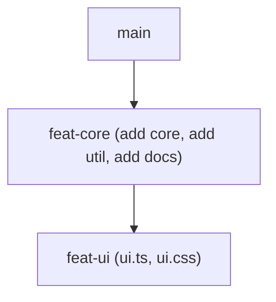

One note on reading `gitq stacks` after surgery: the one-line form lists the stack's nodes in store order joined with `->`, which is a chain only when the tree is a chain. Once a branch has two children, read `gitq stacks --json`, where every node carries its own `parent`. The diagrams below are the real shapes.

## `split --at`: cut the tail off a branch {#split-at}

**When you want it.** One branch has grown three commits' worth of separate ideas and you want the last ones reviewable on their own.

```bash
gitq split feat-core --at d66c1c716084e8947321bf42781952ab55865ed1 --name feat-core-docs
```

```
split feat-core: moved 1 commit(s) to feat-core-docs
```

Everything **after** the named commit moves to the new branch. The named commit itself stays on the source.

Before:

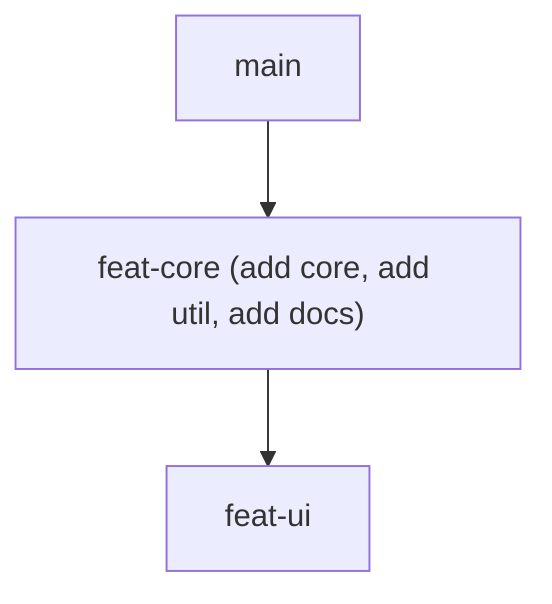

After:

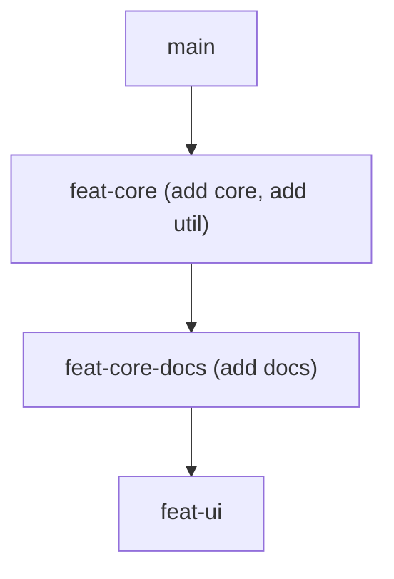

What it does to the tree: the new branch is inserted **between** the source and its children. `feat-ui` was cut from the full three commit `feat-core`, so its base still lives on `feat-core-docs`, and gitq reparents it there rather than leaving it hanging off a branch that no longer contains its base.

No commits are rewritten and no working tree is read or written. gitq creates the new branch at the source's current head first, so nothing is ever unreachable even if the process dies mid-operation, then rewinds the source ref to the split point with a compare and swap:

```bash
git log --oneline feat-core
```

```
d66c1c7 add util
b901484 add core
fdd80d7 initial commit
```

```bash
git log --oneline feat-core-docs
```

```
06df911 add docs
d66c1c7 add util
b901484 add core
fdd80d7 initial commit
```

Because it is pure ref surgery, a dirty working tree is not in the way, unless that tree is the one holding the source branch. The run above was made with an untracked file sitting in the launch worktree, but the worktree itself was checked out on `main`, not `feat-core`, and the file was still there afterwards. Standing on the source branch itself with a dirty tree refuses instead, the way [the example above](#what-surgery-does-to-your-checkout) describes.

### Refusals

:::tip `--at` takes any revision git resolves, above the fork

A short sha copied straight out of `git log --oneline` is fine, as are a full sha, an annotated tag, and a branch name:

```bash
gitq split feat-core --at d66c1c7 --name feat-core-docs
```

```
split feat-core: moved 1 commit(s) to feat-core-docs
```

Age does not matter either: gitq asks git whether the commit is reachable from the branch, so a commit thousands back is as splittable as the one before HEAD.

`HEAD~n` resolves too, but **git resolves `HEAD` against your checkout, not against the branch you named.** Standing on `main`, `--at HEAD~2` picks one of `main`'s commits. Those sit at or below where `feat-core` forks from `main`, so splitting there would rewind `feat-core` under its own base and hand `main`'s commits to the new branch. gitq refuses instead. The run below was made standing on `main`, where `HEAD~2` is two commits below the fork:

```bash
gitq split feat-core --at HEAD~2 --name feat-core-docs
```

```
gitq: Commit "HEAD~2" (4534099abb) is at or below where "feat-core" forks from "main", so splitting there would rewind "feat-core" past its own base and move "main"'s commits onto "feat-core-docs". Note that "HEAD~n" counts back from the checked-out branch, not from "feat-core": use "feat-core~n" instead.
```

Spell it `feat-core~2` and it counts back from the branch being split, which is what you wanted:

```bash
gitq split feat-core --at feat-core~2 --name feat-core-docs
```

```
split feat-core: moved 2 commit(s) to feat-core-docs
```

Naming the parent branch itself (`--at main`) lands on the fork point and is refused the same way: it would leave `feat-core` as nothing but a duplicate of `main`.

:::

| Situation | What you get, always exit `1` |
| --- | --- |
| Split point is already the branch head | `gitq: No commits to split — the split point is already at HEAD` |
| Split point at or below the fork with the parent | `gitq: Commit "main" (3a77704159) is at or below where "feat-core" forks from "main", so splitting there would rewind "feat-core" past its own base and move "main"'s commits onto "feat-core-docs". Note that "HEAD~n" counts back from the checked-out branch, not from "feat-core": use "feat-core~n" instead.` |
| Abbreviation matches more than one commit | `gitq: Commit "63b2" is an ambiguous abbreviation (matches 63b2796818, 63b2bc6d43); use more characters` |
| Revision resolves to nothing, or to a blob or tree rather than a commit | `gitq: Commit "deadbee" does not resolve to a commit in this repository` |
| Revision resolves, but the commit is not reachable from the source branch | `gitq: Commit "<sha>" not found in branch "<branch>"` |
| Source branch is not in the stack | `gitq: Branch "no-such" not found in stack "253747f8-1fc8-4db7-ac34-aded330f2990"` |
| Source branch is in the stack but gone from git | `gitq: Branch "feat-core" is in stack "253747f8-1fc8-4db7-ac34-aded330f2990" but does not exist in this repository` |
| New name is already a branch in the stack | `gitq: Branch "feat-empty" already exists in stack "253747f8-1fc8-4db7-ac34-aded330f2990"` |
| Source checked out dirty in another worktree | the slot policy refuses; see [`split --files`](#split-files) below for the message |

## `split --files`: pull files out of a branch {#split-files}

**When you want it.** One branch changed the API and the stylesheet, and only the stylesheet is ready.

```bash
gitq split feat-ui --files '*.css' --name feat-ui-styles
```

```
split feat-ui: moved 1 file(s) to feat-ui-styles
```

Before:

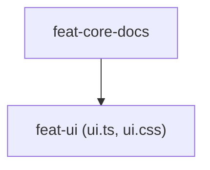

After:

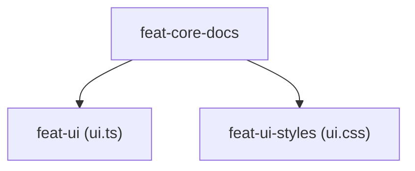

What it does to the tree: unlike `--at`, the new branch is a **sibling**, a second child of the source's parent, not a child of the source. Any existing children of the source stay where they are, under the source.

The new branch is built from the source's merge base with its parent and gets exactly one commit, holding the matched files:

```bash
git log --oneline feat-ui-styles
```

```
fe31508 Split from feat-ui: 1 file(s)
06df911 add docs
d66c1c7 add util
b901484 add core
fdd80d7 initial commit
```

The source keeps its own commits, with its tip commit amended to drop the moved files (or rewound to the merge base, if every file moved). Between them the two branches carry what the one branch used to:

```bash
git diff --name-only feat-core-docs feat-ui
```

```
ui.ts
```

```bash
git diff --name-only feat-core-docs feat-ui-styles
```

```
ui.css
```

The patterns are globs, comma separated for more than one (`--files 'src/api/**,*.json'`). They are matched against the list of files the branch changed relative to its parent, so a pattern matching nothing in that list is an error rather than a no-op.

Unlike `--at`, this one builds commits, so it needs a tree. It uses a leased work slot with a detached HEAD; **your launch worktree is still not touched**, and can still be dirty.

Like `fold`, this rewrites the source branch's own ref, either an amended tip commit or a rewind to the merge base if every file moved. Unlike `fold`, there is no case where that resolves itself: `split --files` never cascades the descendants of the branch it splits, so any existing child of the source is left on the old, now-stale head every time. Run `gitq sync` afterwards to bring them forward.

### Refusals

| Situation | What you get |
| --- | --- |
| No file in the branch matches the patterns | `gitq: No files match the patterns: *.css`, exit `1` |
| The branch changed nothing relative to its parent | `gitq: Branch "feat-empty" has no changed files relative to "feat-a"`, exit `1` |
| Source is checked out in a **dirty** worktree | exit `1`, and nothing moves: |

```bash
gitq split feat-ui --files 'ui.ts' --name never2
```

```
gitq: branch is checked out in slot "wt-ui" (/Users/you/repos/demo/wt-ui) which is dirty; commit or stash there, or free the slot, then retry
```

A *clean* worktree holding the source is fine: it gets reset to the rewritten tip.

## `fold`: merge a branch into its parent {#fold}

**When you want it.** A branch turned out to be one commit of cleanup that belongs to the branch below it, or review asked you to combine two MRs.

```bash
gitq fold feat-core-docs
```

```
folded feat-core-docs into feat-core
```

Before:

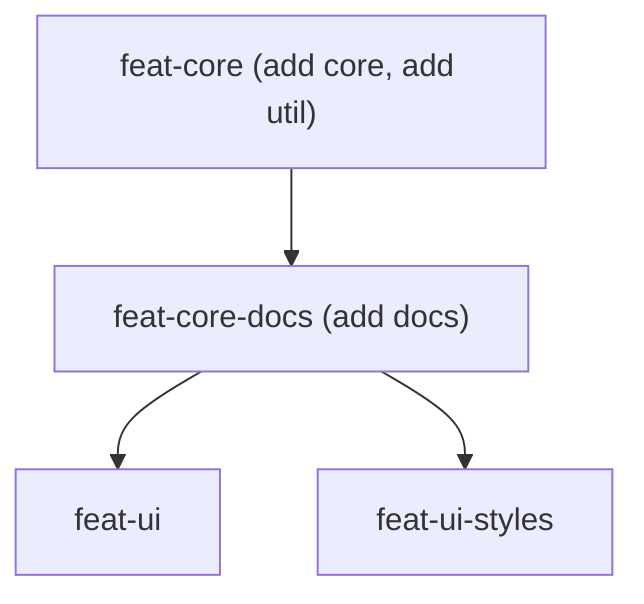

After:

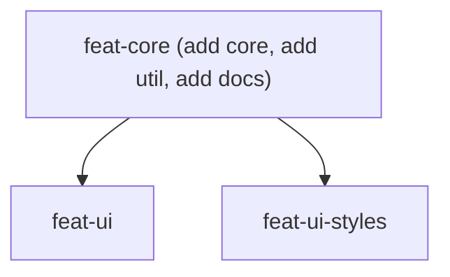

Three things happen together:

1. **The commits move.** The folded branch's own commits are replayed onto the parent, detached in the work slot, and the parent is fast-forwarded to the result with a compare and swap.
2. **The branch is deleted.** From git, and from the stack tree.
3. **Its children are reparented onto the parent.** Both `feat-ui` and `feat-ui-styles` came out under `feat-core`.

```bash
git branch --list
```

```
  feat-core
  feat-ui
  feat-ui-styles
* main
```

```bash
git log --oneline feat-core
```

```
06df911 add docs
d66c1c7 add util
b901484 add core
fdd80d7 initial commit
```

Note that fold does **not** rebase the children. In the usual case it does not need to: the parent was sitting at the folded branch's base, so replaying changed nothing, the parent ends up at exactly the folded branch's old head, and the children are already on it. That is what happened above, where `feat-core` came out at `06df911`, the commit `feat-ui` and `feat-ui-styles` were both cut from. When the parent has moved ahead and the replay produces new commits, the children are left behind their new parent and want a `gitq sync`.

### Fold is the exception to checkout neutrality

Deleting a branch means it cannot stay checked out anywhere. If a clean worktree is holding it, gitq switches that worktree to the parent first. That includes the worktree you ran the command from:

```bash
git status --short --branch
```

```
## feat-quux
```

```bash
gitq fold feat-quux
```

```
folded feat-quux into feat-p
```

```bash
git status --short --branch
```

```
## feat-p
```

The same thing happens to a sibling worktree: one sitting cleanly on `feat-core-docs` came out on `feat-core` after the fold above.

### Refusals

A **dirty** worktree holding the branch stops it up front, with a message that says why folding cares:

```bash
gitq fold feat-ui
```

```
gitq: Branch "feat-ui" is checked out in slot "wt-ui" (/Users/you/repos/demo/wt-ui) which is dirty; commit or stash there first (folding deletes the branch)
```

And if replaying the branch's commits onto the parent conflicts, fold refuses outright rather than pausing. There is no pause protocol here:

```bash
gitq fold feat-leaf
```

```
gitq: Folding "feat-leaf" into "feat-base" hit a rebase conflict (shared.ts); nothing was changed. Sync the stack first, then retry
```

Exit `1`, the branch still exists at its original head, and no lease is left behind. The usual cause is a parent that moved ahead of the child; `gitq sync` first, then fold.

## `reparent --onto`: move a branch and its subtree {#reparent}

**When you want it.** A branch was cut from the wrong place, or its parent got merged and it should hang off trunk now.

```bash
gitq reparent feat-other --onto feat-core
```

```
reparented feat-other from main onto feat-core
```

Before:

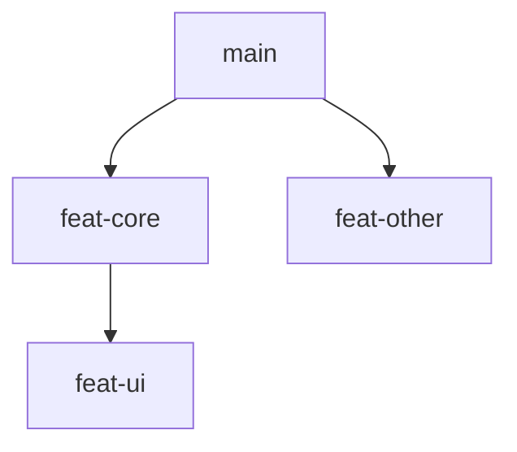

After:

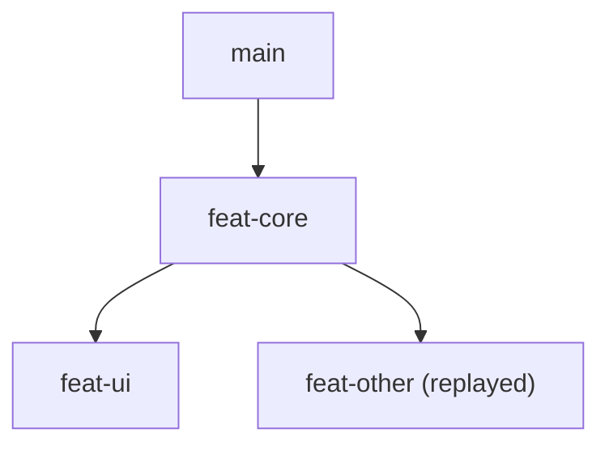

The branch's own commits are replayed onto the new parent's head, detached in the slot, and the ref is moved by compare and swap. Then its descendants cascade onto it, each seeded with the branch's pre-move head so only their own commits replay. That second half is [the cascade](/concepts/cascade), scoped to one subtree and with no fetch.

A move that would make a branch its own ancestor is refused before anything runs.

### Conflict shape one: the branch itself will not replay

If the moved branch's own commits conflict with the new parent, gitq refuses the whole operation. Nothing has moved yet at that point, so backing out is free:

```bash
gitq reparent feat-y --onto feat-x
```

```
gitq: Reparenting "feat-y" onto "feat-x" hit a rebase conflict (shared.ts); nothing was moved. Sync the stack or resolve the divergence first, then retry
```

Exit `1`. The stack tree is unchanged, `feat-y` is still at its old head, and no lease is left. "Nothing was moved" is literal.

### Conflict shape two: a descendant will not replay

If the branch moves cleanly but one of its children conflicts during the follow-up cascade, you get **exit `2` and a pause, exactly like `sync`**:

```bash
gitq reparent feat-p --onto feat-x
```

```
paused on feat-q in /Users/you/.mattstack/gitq/work/80c99b99f76bdc37/gitq-1 (commit ?/?):
  UU shared.ts
resolve with git in that worktree, stage, then: gitq continue (or gitq abort)
```

The pause file is the same document a paused sync writes, with `newBase` and `currentTarget` naming the moved branch instead of `origin/<root>`:

```json
{
  "stackId": "5c8d81a1-79c0-42f6-96b5-533acdbe557b",
  "pauseInfo": {
    "currentBranch": "feat-q",
    "conflictFiles": [
      "shared.ts"
    ],
    "remainingBranches": [],
    "completedBranches": [],
    "mergedBranch": null,
    "newBase": "feat-p",
    "currentTarget": "feat-p",
    "phase": "cascade",
    "conflictTypes": [
      {
        "type": "UU",
        "file": "shared.ts"
      }
    ],
    "preRebaseHeads": {
      "feat-p": "5c1e5f0f0e63101b1a29750959548d78738f6ef0",
      "feat-q": "6b7a1e0465b7d898c145ffbcb666ec3aced2e1e9"
    },
    "worktreePath": "/Users/you/.mattstack/gitq/work/80c99b99f76bdc37/gitq-1"
  }
}
```

Understand what is already done at this point, because it is not "nothing":

- **The move happened.** `feat-p` has been rebased onto `feat-x` and gitq's tree already records `feat-p` under `feat-x`.
- **The descendant has not.** `feat-q` is still at its old head, mid-rebase in the slot.
- **The stack is parked.** Every other mutation on it refuses until you finish.

Resolve in the named worktree, `git add`, and `gitq continue`, exactly as in [Resolve a conflict](/guides/resolve-a-conflict):

```bash
gitq continue
```

```
completed: feat-q ok
```

`gitq abort` here aborts the descendant's rebase, but it does not put `feat-p` back under `main`: that half is already done. And a reparent that exits `2` is deliberately **not** written to the operation log, on the grounds that a paused cascade is resolved with `continue` or `abort` rather than `undo`, so `gitq undo` has no entry for it either. If you want the move reversed after aborting, run another `gitq reparent`.

## `rename`

**When you want it.** The branch name no longer matches what is on it.

```bash
gitq rename feat-q feat-quux
```

```
renamed feat-q to feat-quux
```

Before:

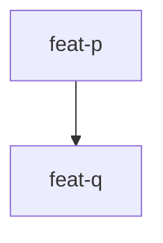

After:

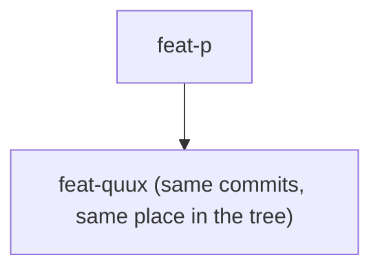

It renames the git branch and the node in gitq's tree in one step, keeping the node's parent and its children. No commits move, and nothing is rebased.

```bash
git branch --list
```

```
  feat-core
  feat-other
  feat-p
  feat-quux
  feat-ui
  feat-ui-styles
  feat-x
  feat-y
* main
```

### Refusals

`rename` rewrites the branch directly in the worktree you ran it from, so it refuses up front when the branch is checked out anywhere else, dirty or not:

```bash
gitq rename feat-ui feat-ui2
```

```
gitq: branch "feat-ui" is checked out in slot "wt-ui" (/Users/you/repos/demo/wt-ui); run this from that worktree or free the branch first
```

Exit `1`. Run it from that worktree, or free the branch there. `gitq reset` refuses on the same rule.

Renaming a published branch does not rename it on the remote. The old branch is still on the forge, and the MR is still attached to it. See [Publish a stack](/guides/publish).

## `reset`: snap a branch back to its remote {#reset}

**When you want it.** Local and remote have diverged, for example someone force-pushed the branch, and you want your local ref to match exactly what is there.

`gitq reset <branch>` requires a clean launch worktree: uncommitted changes stop it with `gitq: Working tree has uncommitted changes. Commit or stash first.` before anything moves. It does not fetch on its own, so make sure your remote-tracking ref for the branch is current first.

### Reset does not move your checkout

Like `split --at`, `reset` is pure ref surgery: it compare-and-swaps `<branch>` to wherever `origin/<branch>` points and never checks anything out. Standing on `feat-a` and running `gitq reset feat-b` leaves you on `feat-a`. If you were standing on `feat-b` itself, you stay on `feat-b` and your clean tree follows it to the remote's head, exactly as [the split example above](#what-surgery-does-to-your-checkout) describes.

It still refuses up front if the branch is checked out somewhere other than your launch worktree, dirty or not, but which message you get depends on where. Another ordinary worktree gets `rename`'s message verbatim, the same `refuseIfCheckedOutElsewhere` guard. A `gitq-N` [work slot](/concepts/work-slots) gets a `reset`-local one instead, `branch "<branch>" is checked out in work slot "<name>" (<path>); free that slot before resetting`, because the shared worktree lookup skips work slots and would otherwise let the ref move out from under a slot's tree. See [`gitq reset`](/reference/surgery/reset) for both.

`reset` is the one surgery command the warning at the top of this page already calls out as unrecorded: it is never written to the operation log, so `gitq undo` has nothing to give back after it. Whatever the branch pointed at before is gone unless you remember the sha yourself.

## Next

- [Resolve a conflict](/guides/resolve-a-conflict): the loop for a reparent that paused.
- [The cascade](/concepts/cascade): what the follow-up restack does.
- [`gitq split`](/reference/surgery/split), [`gitq fold`](/reference/surgery/fold), [`gitq reparent`](/reference/surgery/reparent), [`gitq rename`](/reference/surgery/rename), [`gitq reset`](/reference/surgery/reset).
- [`gitq undo`](/reference/other/undo): what it can and cannot walk back.
