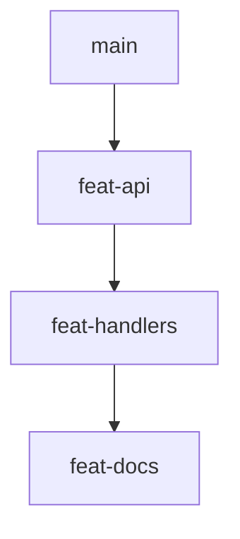

# What is gitq

## Stacked branches

A stacked branch workflow splits one large change into a chain of small branches, where each branch is cut from the one before it instead of from trunk. `feat-api` branches off `main`, `feat-handlers` branches off `feat-api`, `feat-docs` branches off `feat-handlers`. Every branch stays small enough to review on its own, and each one only shows the diff it actually introduces.

The cost is bookkeeping. The moment anything below a branch changes, because trunk moved, because you amended a commit three branches down, or because the bottom of the chain got merged, every branch above it is sitting on a stale base and has to be rebased, in order, from the bottom up. Miss one and the diffs start showing other people's commits.

## What gitq adds

gitq keeps the tree in a store instead of in your head. You tell it which branches belong to a stack and who each one's parent is, and from then on it can answer questions about the whole chain and act on the whole chain.

- It tracks the tree, so `gitq stacks` and `gitq diagnose` can tell you the shape of the stack and which branches are out of date.
- It rebases the whole tree in one command. `gitq sync` walks the stack from the root up, rebasing each branch onto its parent's new head.
- It does surgery on the tree. `absorb` distributes uncommitted changes to the branches that own those files, `split` breaks one branch into two, `fold` collapses a branch into its parent, and `reparent` moves a branch (and its descendants) somewhere else in the tree. Each one restacks whatever it disturbed.

It is deterministic about it: cascades run in a dedicated work worktree with a detached HEAD, and branch refs are moved with a compare-and-swap at the end, so a run that fails or conflicts does not leave your checkout in a state you did not ask for.

## Three surfaces

- **The CLI** is the engine. Every operation is a `gitq` subcommand with a human summary and a `--json` twin. Start at [Your first stack](/getting-started/first-stack).
- **The agent skills** in `skills/` drive that CLI from a Claude pane, one per board action (`gitq:sync`, `gitq:publish`, `gitq:absorb`, `gitq:restructure`), so an agent can work a conflict or a restructure with judgment instead of a script. See [Agent skills](/guides/agent-skills).
- **The board** is a local web view of every configured repo's stacks, with per branch status badges and right-click actions that spawn those agent panes. See [The board](/getting-started/the-board).

## What gitq is not

- **It is not a git replacement.** gitq moves branch refs and records a tree. You still commit, diff, and resolve with plain git, and every branch it touches is an ordinary git branch that any other tool can read.
- **It does not resolve conflicts for you.** When a rebase step conflicts, gitq stops and hands you a normal mid-rebase state in the work worktree, writes a pause file recording where it stopped, and exits `2` so a caller can tell a deliberate pause from a real failure. You fix it with git and run `gitq continue`. See [Resolve a conflict](/guides/resolve-a-conflict).
- **It talks to gitlab.com only.** `publish` and `import` speak the GitLab API against gitlab.com. There is no GitHub support and no self-hosted GitLab support today.

## Where to go next

[Install gitq](/getting-started/install), then build a throwaway three branch stack in [Your first stack](/getting-started/first-stack).
